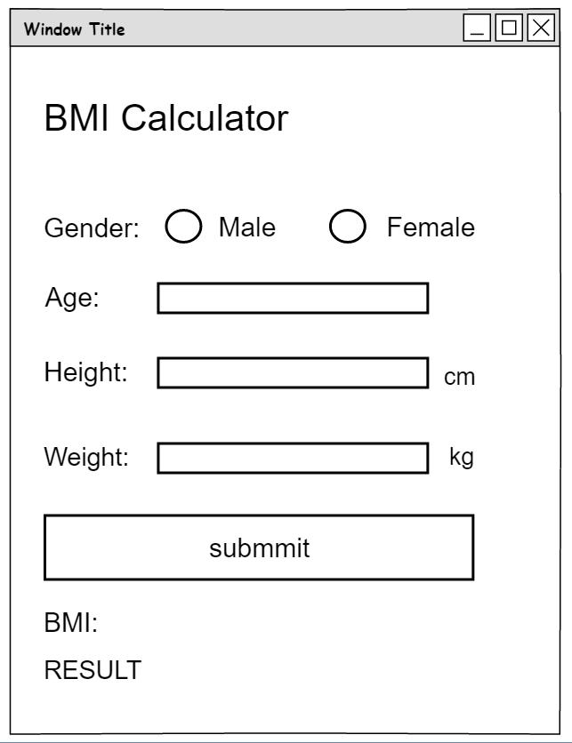
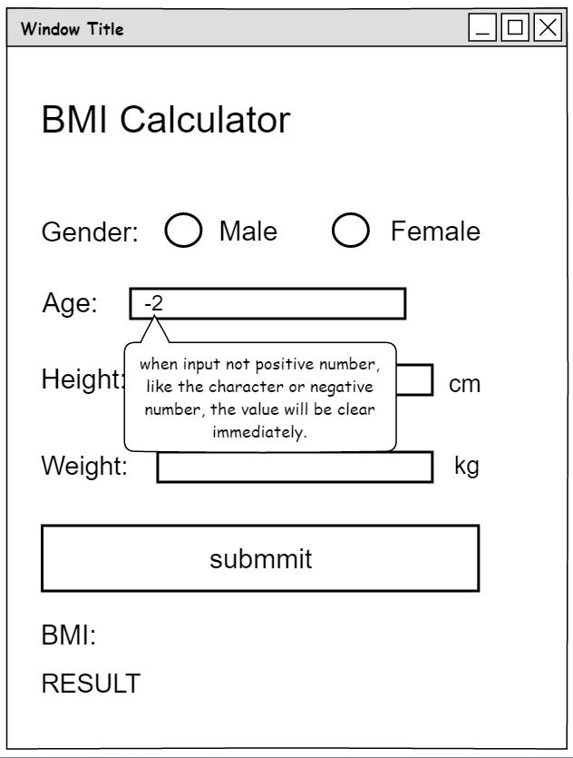
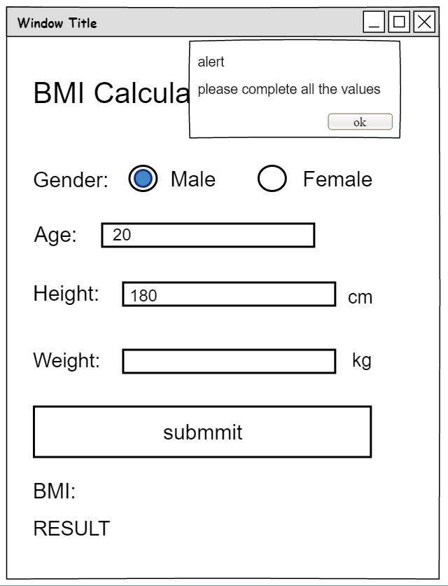
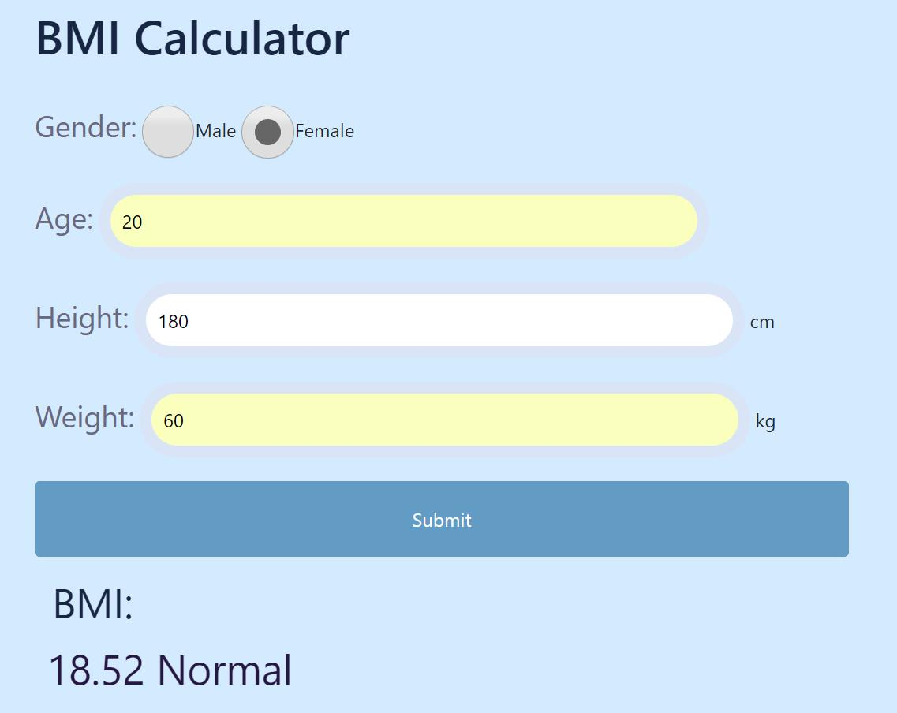
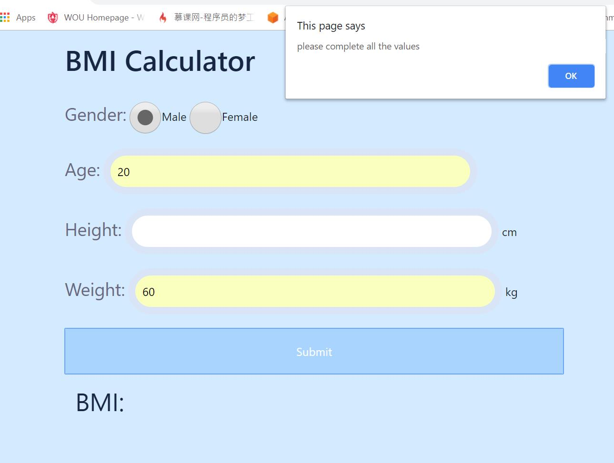

## Homework 2

The second honework is use javascript and jquery in the html so we can write a webpage while with css and bootstrap for the format. The assignment aslo require create a new branch to do it. 


## Links

* [Assignment Page](http://www.wou.edu/~morses/classes/cs46x/assignments/HW2.html)
* [Code Repository](https://github.com/KexinPan/CS460)
* [Final Page](https://kexinpan.github.io/CS460/HW2/sample)
* https://github.com/KexinPan/CS460.git

### Setup the environment

The homework requires a new branch to do it. I created two branches because the first time when I finished the assignment, I found I push it to a wrong folder, so I create a branch and did it again.

Here are some code when I create the new branch.

```
git branch hw2
git checkout hw2
```
Then I create new files on this branch. When I complete the code, I switch to the master branch, then merge the hw2 branch.

```
touch index.html
touch css.html
git add .
git commit -m "completed code"
git push origin hw2
git checkout master
git merge hw2
```

### Think of a project and design it

The first part of my application design is to create a wireframe as the basic layout of my application and will guide my development. I decide to design a BMI calculator, the layout will not be complex because I think it's useful.

I used the [Pencil Project](http://pencil.evolus.vn/) application for my design. This tool is easy to use and it's free.

Here are my wireframes:

#### Basic layout



#### Input Error



#### Submmit Error



### Creating Working Page

I created one html file and one css file, I add javascript and use jquery in the html file.

#### HTML

Here is my html code:

```
<!doctype html>
<html lang="en">
  <head>
    <!-- Required meta tags -->
    <meta charset="utf-8">
    <meta name="viewport" content="width=device-width, initial-scale=1, shrink-to-fit=no">

    <!-- Bootstrap CSS -->
    <link rel="stylesheet" href="https://stackpath.bootstrapcdn.com/bootstrap/4.1.3/css/bootstrap.min.css" integrity="sha384-MCw98/SFnGE8fJT3GXwEOngsV7Zt27NXFoaoApmYm81iuXoPkFOJwJ8ERdknLPMO" crossorigin="anonymous">

    <title>BMI Calculator</title>

    <link rel="stylesheet" href="style.css">
  </head>
  <body>
    

    <!-- Optional JavaScript -->
    <!-- jQuery first, then Popper.js, then Bootstrap JS -->
    <script src="https://code.jquery.com/jquery-3.3.1.slim.min.js" integrity="sha384-q8i/X+965DzO0rT7abK41JStQIAqVgRVzpbzo5smXKp4YfRvH+8abtTE1Pi6jizo" crossorigin="anonymous"></script>
    <script src="https://cdnjs.cloudflare.com/ajax/libs/popper.js/1.14.3/umd/popper.min.js" integrity="sha384-ZMP7rVo3mIykV+2+9J3UJ46jBk0WLaUAdn689aCwoqbBJiSnjAK/l8WvCWPIPm49" crossorigin="anonymous"></script>
    <script src="https://stackpath.bootstrapcdn.com/bootstrap/4.1.3/js/bootstrap.min.js" integrity="sha384-ChfqqxuZUCnJSK3+MXmPNIyE6ZbWh2IMqE241rYiqJxyMiZ6OW/JmZQ5stwEULTy" crossorigin="anonymous"></script>

    <div class="Calculator">
        <h1>BMI Calculator</h1>

    </div>

    <form>
        <!--for age,height and weight, the input will be clear if the value is not positive number-->
        
        <div>
                <label for="gender">Gender:</label>
                <input type="radio" name="sex" value="male" checked>Male
                <input type="radio" name="sex" value="female">Female
        </div>

        <div>
            
            <label for="age">Age:</label>
            <input type="text" id="age" onkeyup="if(this.value.length==1){this.value=this.value.replace(/[^1-9]/g,'')}else{this.value=this.value.replace(/\D/g,'')}"	
            onafterpaste="if(this.value.length==1){this.value=this.value.replace(/[^1-9]/g,'0')}else{this.value=this.value.replace(/\D/g,'')}"/>

        </div>
       
        <div>
            <label for="height">Height:</label>
            <input type="text" id="height" onkeyup="if(this.value.length==1){this.value=this.value.replace(/[^1-9]/g,'')}else{this.value=this.value.replace(/\D/g,'')}"	
            onafterpaste="if(this.value.length==1){this.value=this.value.replace(/[^1-9]/g,'0')}else{this.value=this.value.replace(/\D/g,'')}"/>
            <span class="input-group-addon">cm</span>
        </div>

        <div>
            <label for="weight">Weight:</label>
            <input type="text" id="weight" onkeyup="if(this.value.length==1){this.value=this.value.replace(/[^1-9]/g,'')}else{this.value=this.value.replace(/\D/g,'')}"	
            onafterpaste="if(this.value.length==1){this.value=this.value.replace(/[^1-9]/g,'0')}else{this.value=this.value.replace(/\D/g,'')}"/>
            <span class="input-group-addon">kg</span>
        </div>
        <!--once the submit button is hit, we'll call a javascript function to calculate the BMI value, create the output element, and show the result in the page-->
        <div class="button">
            <input type="submit" onclick="return BMICalculation()">
        </div>
    </form>
    <!--the output title-->
    <div class="outvalue">
        <div class="col-sm-4">BMI:</div>
        <div id="valueOutput"></div> 
    </div>
  </body>
</html>
```

#### CSS

I use the style.css file that I created by myself.

```
body{
    padding-left: 6em;
    background-color: #d3eaff;
}
input[type=text], select {
    width: 45%;
    padding:10px 10px;
    display:inline-block;
    border: 10px solid #d9e4f7;
    border-radius: 40px;
    box-sizing: border-box;

}

input[type=submit] {
    width: 60%;
    background-color: rgb(98, 156, 196);
    color: white;
    padding: 20px ;
    
    border: none;
    border-radius: 4px;
    cursor: pointer;
}

input[type=radio] {
    display: inline-block; 
    vertical-align: middle; 
    width: 45px; height: 45px; 
    border: 2px solid rgb(160, 183, 199); 
    border-radius: 10px;
    background: radial-gradient(rgb(182, 228, 255), rgb(93, 99, 119));
}
label{
    color: #6a687e;
    line-height: 150%;
    font-size:25px;
}
input[type=submit]:hover {
    background-color: #a8d4fd;
}
div {
    padding: 10px;
}
h1{
    color: #172642;
    line-height: 150%;
    font-size:40px;
}
.col-sm-4{
    color: #172642;
    line-height: 100%;
    font-size:35px;
    display: inline;
}
#valueOutput{
    color: #261742;
    line-height: 150%;
    font-size:35px;
}
```
#### Function

After the basic layout of the webpage, I add some javascript and jquery function in the html file, when user submmit the value, the function will run and calculate the BMI value.

```
<!--functions for the BMI calculation-->
    <!--Validation is for make sure all the variables have a value-->
    <!--BMIValue is use JQuery to get the value and calculate the BMI value-->
    <!--BMICalculation is a function to run Validation and calculate the BMI value-->
    <script>

        function Validation() {
                    return $("input:radio[name='sex']").is(":checked")&& $("#age").val()!==""
                    && $("#weight").val()!=="" && $("#height").val()!=="";
        }
        
        function BMIValue() {
            var value = 0;
            weightValue = $("#weight").val();
            heightValue = $("#height").val();
            value= 10000*weightValue/(heightValue*heightValue);
            $("#valueOutput").html(value.toFixed(2));
            if(value<=16){
            $("#valueOutput").append("  Severe Thinness");
            }
            if(value>16&&value<=18.5){
            $("#valueOutput").append("  Mild Thinness");
            }
            if(value>18.5&&value<=25){
            $("#valueOutput").append("  Normal");
            }
            if(value>25&&value<=30){
            $("#valueOutput").append("  Overweight");
            }
            if(value>30){
            $("#valueOutput").append("  Obese");
            }
        }

        function BMICalculation(){
            if(Validation()){
                BMIValue();
            }
            if(!Validation()){
                alert("please complete all the values");
            }
                return false;
        }
    </script>
```
### Final Page

In the final page, the normal result will look like:



The alert will appear if the values are not complete when click the button:




