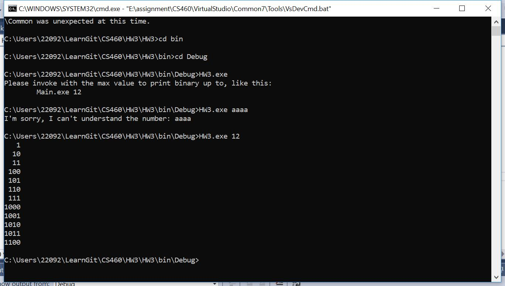

## Homework 3

For this task, we're going to complete the task of creating a C# implementation of a previously written Java application. The goal of this project is to write the sample C# application to demonstrate the knowledge of the C# language and development tools.

From this project, I found java and C# are similar, there are some different syntax and you need to replace the common variable to another.


## Links

* [Assignment Page](http://www.wou.edu/~morses/classes/cs46x/assignments/HW3.html)
* [Code Repository](https://github.com/KexinPan/CS460/tree/master/HW3)
* https://github.com/KexinPan/CS460.git

### Enviroment Setup

#### Setting Up Visual Studio

I installed Visual Studio 2017 and choose Cosole App use .net framework. I struggled for how to add different class under one project, I thought it would has a package like java, I searched online and found the classes under namespace were like in one package.

The first time I'm afraid that I will do something wrong and hard to fix it, so I use another folder to create my project instead of create it first to push to my repository.

#### Coding

Java and C# are similar, there are some differences on syntax and variables.

The structure of C# look like:

```
namespace HW3
{
    class Class1
    {
        fuction()
        {

        }
    }
}

```
I tooke down some differences between java and C# in this project on my note:
```
java: length();  equivelent in C#: string.Length;
string to int: int i; i=System.Convert.ToInt32(string);
java: NullPointerException equivelent in C#: NullReferenceException
java: RuntimeException equivelent in C#: SystemException
java: LinkedList.add() equivelent in C#: LinkedList.AddLast();
java: super() equivelent in C#: base();

```
The most difficult part for me is the super() in java convert to base() in C#, I just replaced the word first, but it didn't work, after class, I know I shoudl use another structure to use it:

```
public QueueUnderflowException() : base()
{

 }

public QueueUnderflowException(string message) : base(message)
{
}
```

#### Test

After debugging several times, the code works:

When run without input numbers:


When run with input some characters:


When run with correct number:




