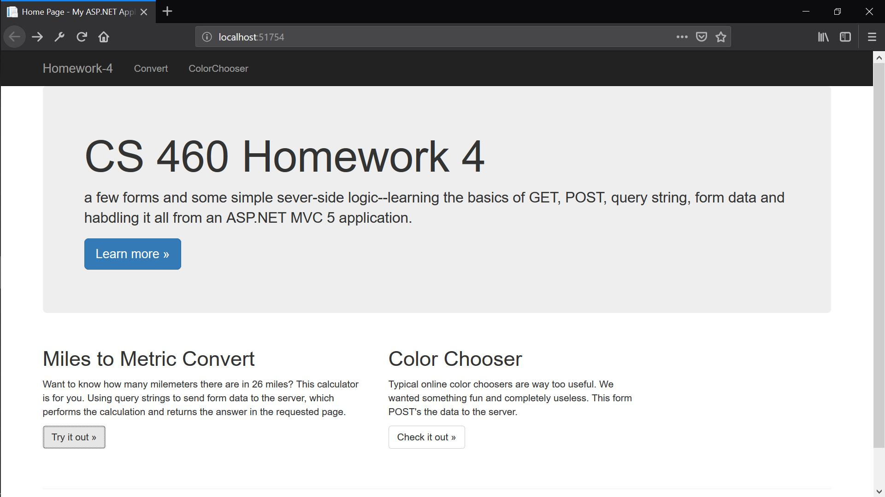
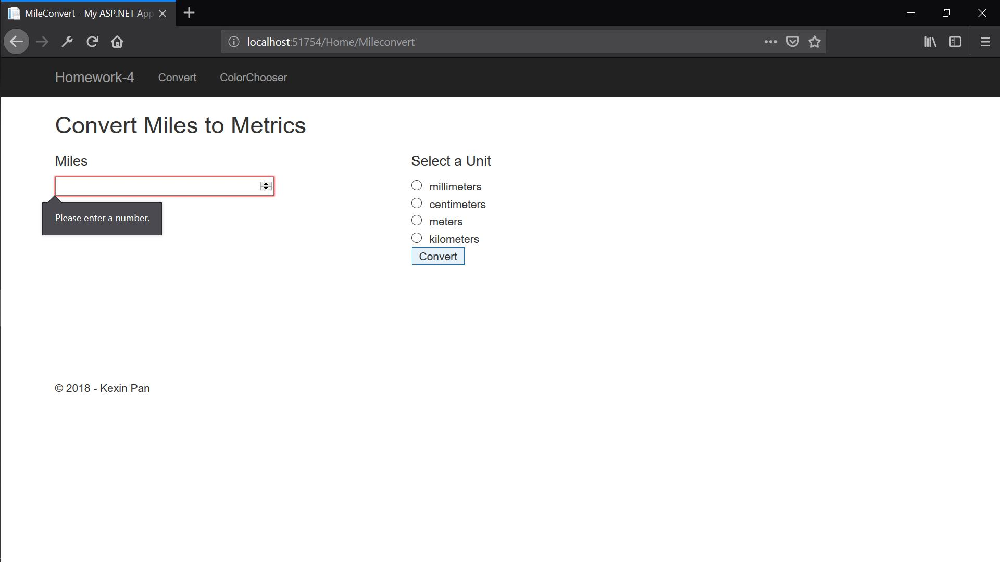
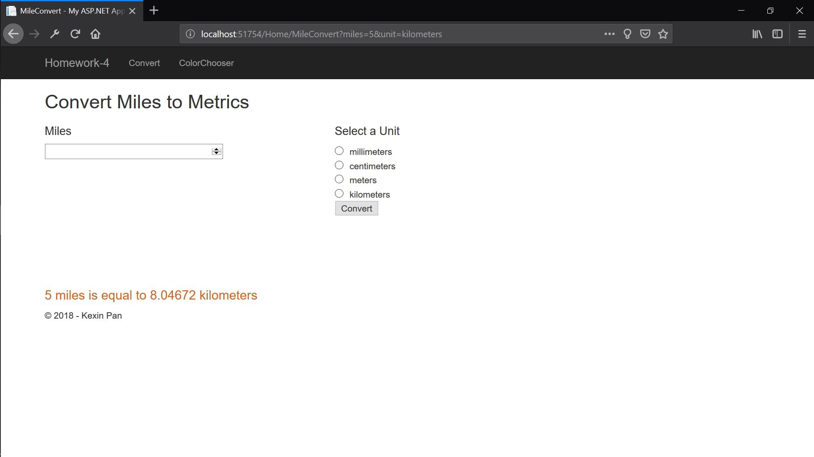
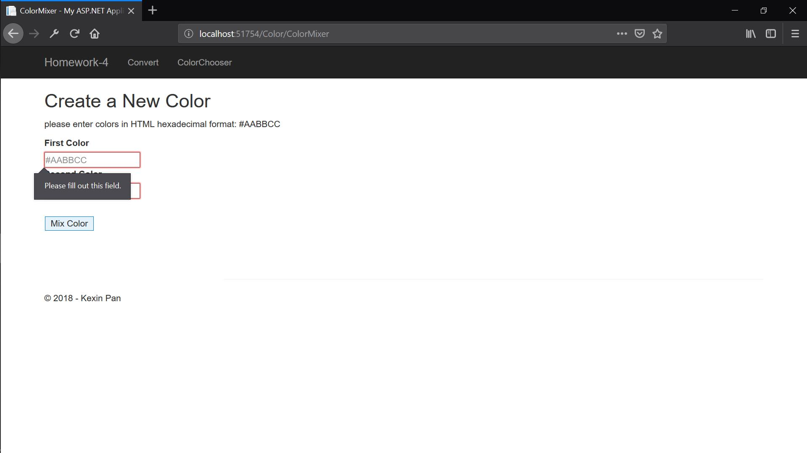
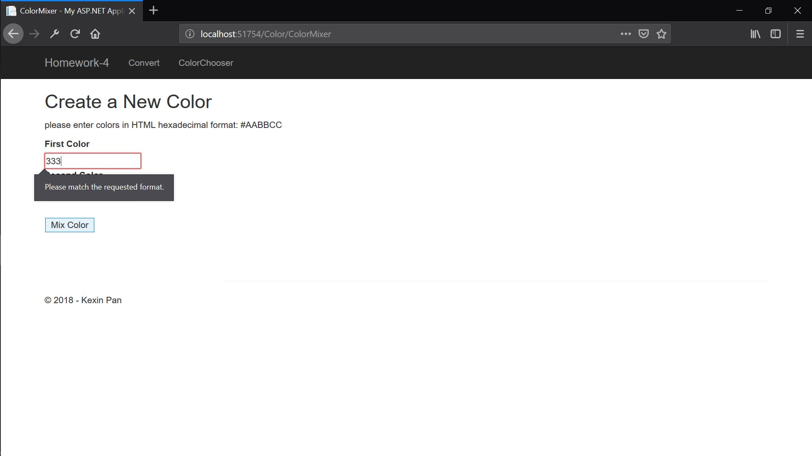
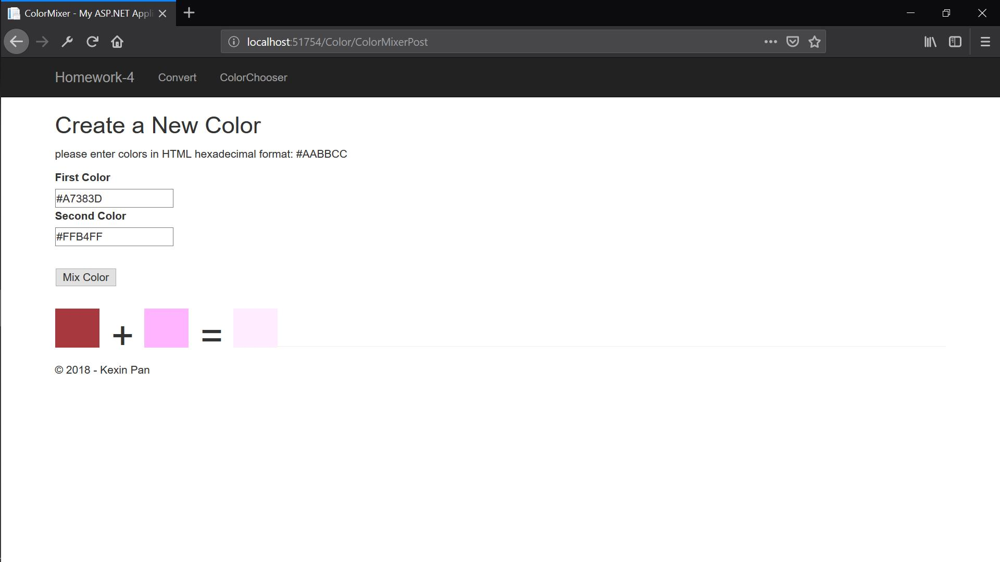

## Homework 4

For this task, we're going to create a MVC project by using asp.net, the project in the video seems interesting. There are different requirements for mile convert and color mixer, the first one need GET method and the second one requires POST method, so we can practice the difference between GET and POST method. 

We also need to create new two different branch to develop our project, so we can learn how to deal with the conflicts when we merge.


## Links

* [Assignment Page](http://www.wou.edu/~morses/classes/cs46x/assignments/HW4_1819.html)
* [Code Repository](https://github.com/KexinPan/CS460/tree/master/HW4)
* https://github.com/KexinPan/CS460.git


### Setting Up MVC Project

This is the first time I create .net project, I followed the instruction on class and it becomes pretty easier than I struggled by myself.

For the .gitignore file I used the last time in the homework 3, but there are still a lot of files and they seem necessary for this project. So I leave them and push to the remote.

### Coding

The mileConvert is easy when I figured out the relationship between Controller and View, it's super smart by match the name to find the action and return corresponding ViewPage.

I added an action called MileConvert in HomeController and add a view for it.

I don't think I should put the complete code in the portfolio, so I select some code and paste here. And for the code, please read the code in the [Code Repository](https://github.com/KexinPan/CS460/tree/master/HW4), it follows every step, including branch and merge. Please don't grade the code in the github.io folder, I just copied and paste the code to github.io without branch and merge. 

The C# Code for MileConvert action look like:

```
 [HttpGet]
        public ActionResult MileConvert()
        {
            /// get the value of miles in user input
            string mileValue = Request.QueryString["miles"];
            /// get the type of unit that usee choose
            string unit = Request.QueryString["unit"];
            /// set the result as a double value
            double value = Convert.ToDouble(mileValue);
            if (mileValue != null)
            {
                string message = "non";
                if (unit.Equals("millimeters"))
                {
                    message = value + " miles is equal to " + value * 1609344 + " millimeters";
                }
                if (unit.Equals("centimeters"))
                {
                    message = value + " miles is equal to " + value * 160934.4 + " centimeters";
                }
                if (unit.Equals("meters"))
                {
                    message = value + " miles is equal to " + value * 1609.344 + " meters";
                }
                if (unit.Equals("kilometers"))
                {
                    message = value + " miles is equal to " + value * 1.609344 + " kilometers";
                }
                ViewBag.message = message;
            }

```
I have to say the ViewBag is convenient, it can pass many kinds of data from Controller to the View.
And in the cshtml file, I can display the result by the use of Razor Code:

```
 @if (ViewBag.message != null)
   {
      <p>@ViewBag.message</p>
   }
```
For the ColorMixer, it's a little bit harder bacause I am not very clear for how to POST data in webpage. I falied when I have a webpage and try to produce some data by click button, then the professor told me I need two methods for this page. One is HttpGte, to get the webpage format befor I submmit any value. Another is HttpPost, to show the result in the page.

The structure of ColorMixer look like:

```
[HttpGet]
public ActionResult ColorMixer(string firstColor, string secondColor)
 {
     return View();
 }
 
  [HttpPost]
 public ActionResult ColorMixerPost(string firstColor, string secondColor)
 { 
   Color _firstColor = ColorTranslator.FromHtml(firstColor);
   Color _secondColor = ColorTranslator.FromHtml(secondColor);
   
    int thirdColorR = _firstColor.R + _secondColor.R;
    if (thirdColorR > 255) { thirdColorR = 255; }
    int thirdColorG = _firstColor.G + _secondColor.G;
    if (thirdColorG > 255) { thirdColorG = 212; }
    int thirdColorB = _firstColor.B + _secondColor.B;
    if (thirdColorB > 255) { thirdColorB = 255; }

    Color _thirdColor = Color.FromArgb(thirdColorR, thirdColorG, thirdColorB);
    string thirdColor = "#" + _thirdColor.R.ToString("X2") + _thirdColor.G.ToString("X2") + _thirdColor.B.ToString("X2");
            
            ViewBag.firstItem = firstColor;
            ViewBag.secondItem = secondColor;
            ViewBag.plusItem = "+";
            ViewBag.equalItem = "=";
            ViewBag.thirdItem = thirdColor;

            return View("ColorMixer");         
 }
```

The most difficult part for me is how to display the color as block, I add some html code <div> in the ViewPage and set the background use the ViewBage data.

```
 @Html.Label("Second Color")
    <br>
 @Html.TextBox("secondColor", null, htmlAttributes: new { placeholder = "#12HHFF", pattern = "^#([A-Fa-f0-9]{6}|[A-Fa-f0-9]{3})$" })
    <div style="padding-top:2em">
        @Html.TextBox("mixcolor", "Mix Color", htmlAttributes: new { type = "Submit" })
    </div>
    <div style="padding-top:2em">
        <div class="colorFItem" , style="background-color: @ViewBag.firstItem"></div>
        <div class="colorPItem">@ViewBag.plusItem</div>
        <div class="colorSItem" , style="background-color: @ViewBag.secondItem"></div>
        <div class="colorPItem">@ViewBag.equalItem</div>
        <div class="colorTItem" , style="background-color: @ViewBag.thirdItem"></div>
    </div>
```

### Merge Branch

As the requirement, I complete the code of MileConvert in hw4-convert branch and complete the ColoeMixer code in another branch, then merge them to master.

### Test

After debugging several times, the code works well and the effect looks like the video shows:

The main page:



When run mile convert with empty value:



When run mile convert with unappropriate input:


When run mile convert with correct input:



When run color mixer with empty value:



When run color mixer with unappropriate input:



When run color mixer with correct input:




