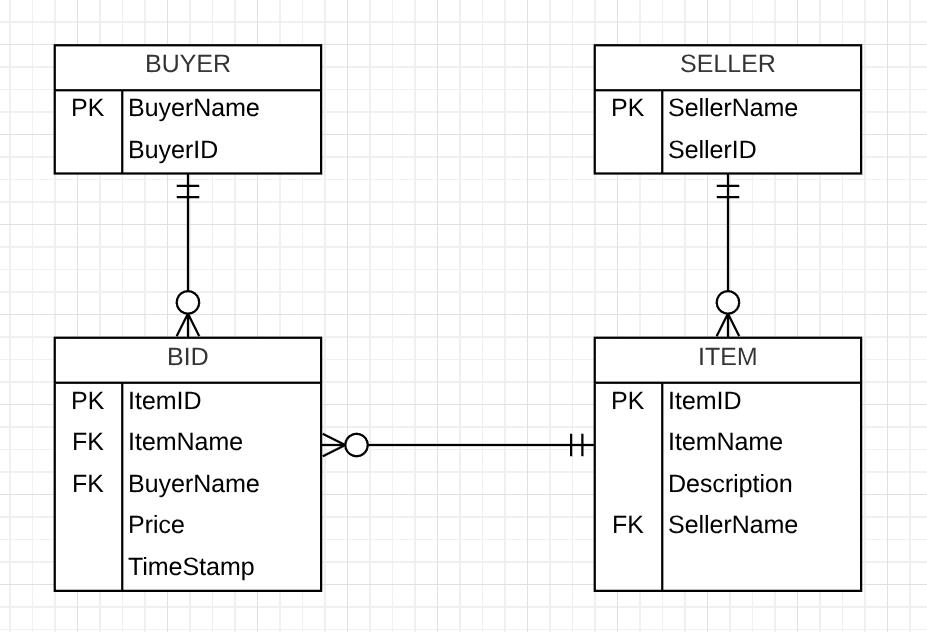

## Homework 8

For this task, we're going to create a MVC web application that uses a multi-table, relational database and use a “Code First with an Existing Database” workflow.

## Links

* [Assignment Page](http://www.wou.edu/~morses/classes/cs46x/assignments/HW8_1819.html)
* [Code Repository](https://github.com/KexinPan/CS460/tree/master/HW8Two)
* [Video Demo](https://youtu.be/KKjnPv83tFA) There is no audio for this video(because I'm not comfortable with my own voice😳)
* https://github.com/KexinPan/CS460.git

