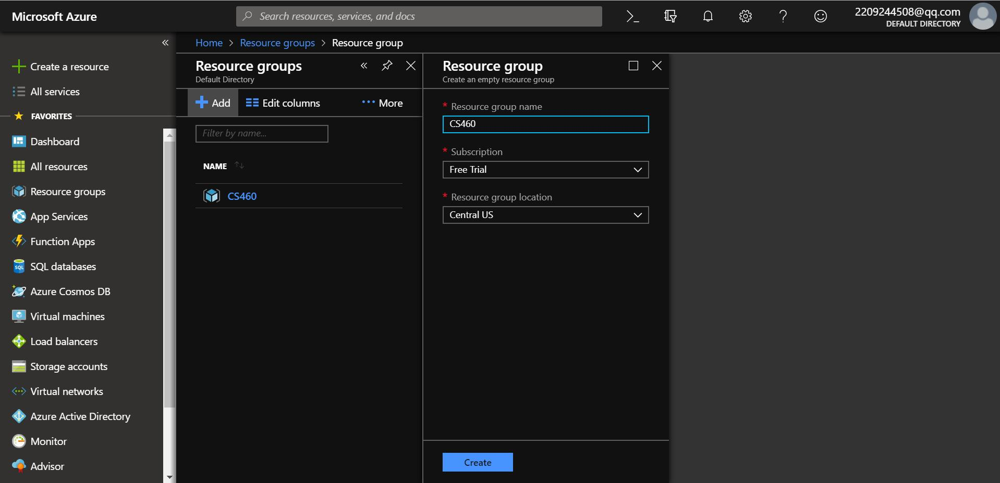
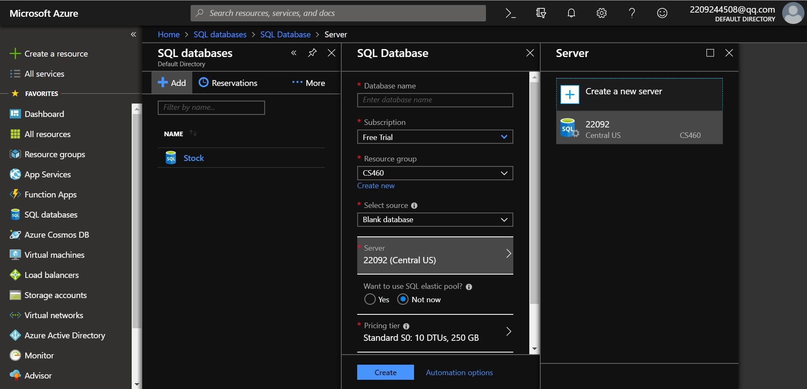
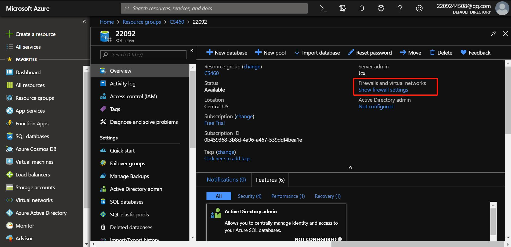
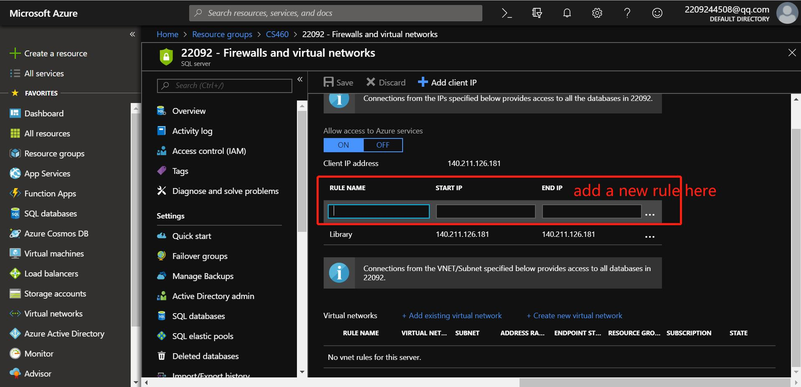

## Homework 9

For this task, we're going to deploy the MVC web application built in HW8 to the cloud and use Azure for both the web application and the database.

## Links

* [Assignment Page](http://www.wou.edu/~morses/classes/cs46x/assignments/HW9_1819.html)
* [Code Repository](https://github.com/KexinPan/CS460/tree/master/HW9)
* [Azure App Link](https://cs460hw9.azurewebsites.net)
* https://github.com/KexinPan/CS460.git

## Steps

### set up

Create resource group on Azure:

Create Database and Database server:

Add firewall rules:

### connect to SSMS:

Get the server name:
.jpg)

Log in SSMS:
.jpg)

After connection:
.jpg)

Connect the databse to Azure:
.jpg)

After add tables:
.jpg)

### connect to Azure database

Add connetion string:
.jpg)

### deploy app to azure

Create an app on Azure:
.jpg)

Add an app connetion string:
.jpg)

Deploy the application:
.jpg)

Deploy successfuly:
.jpg)

